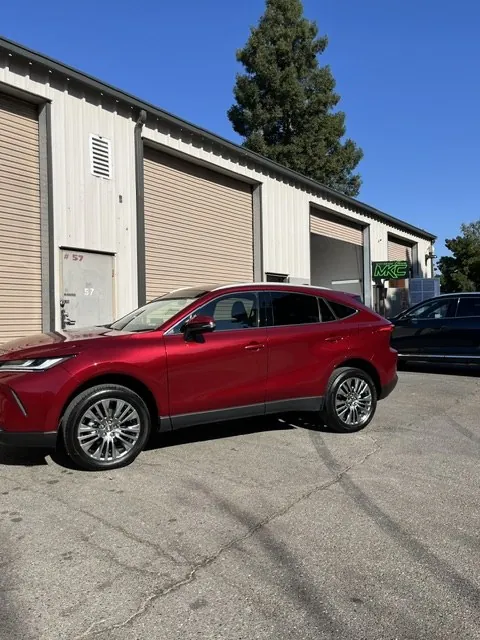

# Mike Knight Customs: Site Architecture and Design System v1.0

Direction: **Luxury Minimalist / Mechanical Grit**. Deep ink backdrops, 1px structural borders, editorial asymmetry, monospace data readouts. Evolved from the baseline deployment at mike-knight-web0-1.vercel.app.

---

## 1. Full Navigation Hierarchy

Maps every baseline Vercel route into the evolved architecture. The five baseline service links consolidate into three authoritative destinations (thin pages dilute authority; pillar pages compound it).

```
MKC (root)
│
├── /index.html ·················· PAGE A — Homepage (built)
│
├── SERVICES (dropdown)
│   ├── /services/collision-frame-repair.html ····· PAGE C
│   │     ← absorbs baseline: /services/collision-repair.html
│   ├── /services/paint-coating-detailing.html ···· PAGE D
│   │     ← absorbs baseline: /services/custom-paint.html
│   │                         /services/ceramic-coating.html
│   │                         /services/detailing.html
│   └── /oem-advocacy.html ·················· PAGE B (built)
│         ← elevates baseline: /services/insurance-assistance.html
│
├── /oem-advocacy.html ····· "OEM Advocacy" (top-level pillar link)
├── /recent-work.html ······ "Recent Work" — case-file gallery of real projects
│                            (photos live in images/work/<project>/)
├── /contact.html ················ Quote form + map + carriers
│
└── Footer utility: Google Maps · Facebook · Instagram · Yelp
```

**Redirect map (SEO preservation):** 301 each old baseline URL to its new destination above.

---

## 2. Design System Tokens (see css/mkc.css)

| Token | Value | Role |
|---|---|---|
| `--ink` | `#0B0F12` | Page base, deep ink slate |
| `--ink-2` | `#10151A` | Raised panels / alternating bands |
| `--line` | `#222B33` | 1px structural borders (never box-shadows) |
| `--white` | `#F4F7F9` | Display type & headings |
| `--silver` | `#98A2AB` | Body copy |
| `--silver-dim` | `#5E6972` | Captions / index labels |
| `--mkc-green` | `#A8F040` | Single industrial accent, focus points only |

**Typography**
- Display, `Anton`: heavy condensed mechanical sans, uppercase, 1.0 line-height. Headlines only.
- Body, `Archivo`: geometric, hyper-legible, 400/500/600. 1.6 line-height.
- Data, `IBM Plex Mono`: uppercase, 0.14em tracking. All metrics, indices, readouts, buttons, eyebrows.

**Fluid scale**: type (`--step--1` … `--step-4`) and rhythm (`--space-2` … `--space-6`)
are `clamp()` ramps with hard upper bounds, so a 1920px display gets the same
capped sizes as a 1440px one rather than continuing to grow. Content container
is `--max-w: 1320px`. There is no phone-only spacing override: the clamps handle it.

| Token | 375px | 1440px+ |
|---|---|---|
| `--step-4` display | 38px | 70px |
| `--step-3` | 29px | 45px |
| `--step-0` body | 15px | 16px |
| `--space-6` section pad | 52px | 88px |

**Touch targets**: every control clears 44px. Sizing that exists only to hit
that minimum (footer links, gallery captions, readout links) is scoped to
`@media (hover: none)` so pointer devices keep the tighter desktop rhythm.

**Fonts**: Anton, Archivo and IBM Plex Mono are self-hosted from `fonts/`
(SIL OFL 1.1, license text alongside the files). Same-origin, so no
third-party DNS, TCP or TLS handshake sits on the critical path and the
typography cannot silently fall back to system metrics when a CDN is
unreachable. Only latin and latin-ext subsets ship; `unicode-range` means a
browser fetches a file only when the page needs those codepoints, so an
English page pulls just the four latin faces (~81 KB). The three faces that
paint the first screen are preloaded.

**Images**: photographs ship as WebP at quality 85 (~30 percent smaller than
the JPEG sources, worst-case PSNR 38.5 dB), with an AVIF at quality 65 offered
ahead of it through `<picture>`:

```html
<picture>
  <source type="image/avif" srcset="images/work/venza/venza-01.avif" />
  
</picture>
```

AVIF takes a further ~23 percent off the WebP for browsers that support it;
everyone else still gets the WebP from `src`. `picture { display: contents }`
keeps the wrapper out of the box tree, so the `` stays the grid/flex item
and wrapping an image never changes layout.

The Open Graph, Twitter card and JSON-LD `image` URLs deliberately stay JPEG:
social crawler support for WebP is inconsistent and a broken share preview
costs leads. Flat-art carrier logos stay SVG or PNG wherever WebP and AVIF did
not beat them. The nav logo is one of these, a 10 KB PNG that neither format
improved on.

**Do not hand-write any of this.** `tools/optimize-images.mjs` generates the
AVIF and rewrites the markup:

```bash
cd tools && npm install     # once
ORIGINALS_DIR=/path/to/masters node tools/optimize-images.mjs
node tools/optimize-images.mjs --check     # report only
```

It is idempotent, skips images already wrapped, and drops any variant that does
not actually beat the file it would replace.

**Where the masters live.** The full-resolution JPEG/PNG originals are no longer
in the working tree; they were removed when the site moved to WebP. AVIF must
still be encoded from those masters, never from the shipped WebP, because
encoding one lossy format into another stacks a second generation of loss.
Recover them from a commit that predates the migration, for example the tag
`backup/pre-reconcile-53f3768`:

```bash
git cat-file blob backup/pre-reconcile-53f3768:images/work/venza/venza-01.jpg > masters/...
```

then point `ORIGINALS_DIR` at that folder. With no master available the script
refuses to encode and says so rather than quietly shipping a degraded image.

**Known limit:** the source photos are 480x640. That is fine for the gallery
grid but means the lightbox upscales on a retina phone. Higher-resolution
originals are the only fix; re-encoding cannot recover detail that is not there.

**Signature components**

Shared, defined in `css/mkc.css`:
- `.meta-point`: border-scoped spec rows (replaces icon boxes)
- `.readout`: mono data-readout tables with `is-live` green values
- `.spec-frame`: 1px frame with blueprint corner ticks in accent green
- `.compare`: draggable before/after clip comparator
- `.lightbox`: full-bleed photo viewer, built by `js/mkc.js` and opened from
  `.case__photo img`, `img[data-zoom]` and `.compare img`

Page-scoped, despite the shared-looking names. Each is defined only in its own
page's `<style>` block and has no rule in the global stylesheet. Promote one
into `css/mkc.css` before using it on a second page rather than copying the
block:
- `.matrix`: technical contrast table (OEM column tinted green). Defined in
  `oem-advocacy.html`
- `.step`: 3-column advocacy framework rows with outlined display numerals.
  Defined in `contact.html`

---

## 3. PAGE C Blueprint: Collision and Frame Repair

Theme: **surgical mechanical precision**. Every section reads like a calibration report.

```
┌──────────────────────────────────────────────────────────────┐
│ MASTHEAD  eyebrow: SERVICE FILE · MKC-SVC/01                 │
│ H1: STRUCTURE, RESTORED TO THE MILLIMETER.                   │
│ readout: Frame Tolerance ±1mm · Laser Measured · OEM Welds   │
├──────────────────────────┬───────────────────────────────────┤
│ COL 1 — STRUCTURAL       │ COL 2 — ELECTRONIC                │
│ Frame straightening      │ Unibody alignment tolerances      │
│ (computerized bench,     │ (datum-point verification vs      │
│ anchored pulls, factory  │ factory dimension sheets)         │
│ datum sheets)            │                                   │
│ Multi-panel reconstruct- │ ADAS sensor recalibration         │
│ ion metrics: weld count, │ protocol: static/dynamic cal,     │
│ seam sealer, e-coat,     │ radar aim, camera targets,        │
│ corrosion protection     │ printed calibration report        │
├──────────────────────────┴───────────────────────────────────┤
│ PROOF CENTER — GMC Sierra comparator w/ measurement readout  │
│ CTA — "Request a structural assessment"                      │
└──────────────────────────────────────────────────────────────┘
```

Dual columns are separated by a single 1px `--line` rule; each item is a `.meta-point`-style row with a mono metric on the right (e.g., `WELD SPEC: GM SI DOC 24-NA-021`).

---

## 4. PAGE D Blueprint: Paint Matching, Ceramic and Detailing

Theme: **texturally rich, staggered rhythm**. Alternating rows with unexpected column breaks (7/5 → 4/8 → 6/6-offset) so no two bands repeat.

```
┌──────────────────────────────────────────────────────────────┐
│ MASTHEAD  H1: FINISHES YOU CANNOT FIND IN DIRECT SUNLIGHT.   │
├───────────────────────────────┬──────────────────────────────┤
│ ROW 1 (7/5) IMG left          │ Invisible Color Match:       │
│ AMG GLE53 blend photo         │ spectrophotometer formula,   │
│                               │ blended panel transitions    │
├───────────────┬───────────────┴──────────────────────────────┤
│ ROW 2 (4/8)   │ Ceramic Protection: 9H hardness, UV shield,  │
│ readout:      │ hydrophobic maintenance, multi-year film     │
│ coating spec  │ integrity — copy right, break comes early    │
├───────────────┴───────────────────┬──────────────────────────┤
│ ROW 3 (6/6, pushed right +1 col)  │ MARINE & AVIATION        │
│ Concours detailing: paint         │ Why local pilots & boat  │
│ correction stages, interior spec  │ owners choose MKC —      │
│                                   │ gelcoat & aerospace-     │
│                                   │ grade finish standards   │
├───────────────────────────────────┴──────────────────────────┤
│ CTA — "Book a finish consultation"                           │
└──────────────────────────────────────────────────────────────┘
```

---

## 5. Files in this build

There is no build step and no bundler, so the repo is the deploy artifact:
what is committed is what Vercel serves, minus whatever `.vercelignore`
excludes. This list is therefore a deploy manifest as much as an index.

**Pages.** Letters refer to the blueprints in §1, §3 and §4. Internal links are
extensionless because `vercel.json` sets `cleanUrls`.

| File | Role |
|---|---|
| `index.html` | PAGE A, homepage |
| `oem-advocacy.html` | PAGE B, OEM advocacy pillar |
| `services/collision-frame-repair.html` | PAGE C |
| `services/paint-coating-detailing.html` | PAGE D |
| `recent-work.html` | Case-file gallery, comparators, lightbox |
| `contact.html` | Quote form, location card, carrier logos |
| `privacy.html`, `terms.html`, `accessibility.html` | Legal set, see §6 |
| `404.html` | Designed not-found page |

**Shared front end**

| Path | Role |
|---|---|
| `css/mkc.css` | The whole design system: tokens, type, grid, nav, footer, components (§2) |
| `js/mkc.js` | Nav toggle, services submenu, scroll reveals, before/after comparators, photo lightbox |
| `fonts/` | Self-hosted woff2 for Anton, Archivo and IBM Plex Mono, with `fonts.css` and the OFL licenses. Deliberately not Google Fonts |
| `images/` | Photography and icon set. Work photos live in `images/work/<project>/` as WebP with an AVIF layer offered first |

**Measurement, consent and legal.** `js/mkc-consent.js`, `js/mkc-analytics.js`,
`middleware.ts` and `tools/check-legal-dates.mjs`. Covered in full in §6,
including the load order, which is not arbitrary.

**Platform config**

| File | Role |
|---|---|
| `vercel.json` | `cleanUrls`, the §1 redirect map, cache headers, security headers |
| `package.json` | Exists only so Vercel can compile `middleware.ts`. No build script. Do not add one |
| `robots.txt`, `sitemap.xml` | Crawl directives, and the nine indexed URLs |
| `favicon.ico`, `images/favicon-*`, `images/apple-touch-icon.png` | Icon set |
| `.vercelignore` | The deploy boundary. Currently excludes `tools/` and `node_modules/` only |
| `.claude/launch.json` | Local preview target `mkc`, port 4188 |

**Local only**

| Path | Role |
|---|---|
| `tools/` | Image tooling and the legal-date check. Has its own `package.json`, is `.vercelignore`d, and is not part of any build |

**Repo documentation.** `ARCHITECTURE.md` (this file), `CLAUDE.md` (the working
guide for Claude Code), and `docs/`: `measurement-plan.md`,
`console-setup-checklist.md`, `client-explainer.md`.

> **Known gap.** Those five Markdown files are not in `.vercelignore`, so they
> upload with the site and are fetchable, for example
> `/docs/console-setup-checklist.md`. Nothing in them is a credential, but they
> carry Parabox account structure and internal email addresses on a client
> domain. They are absent from `sitemap.xml`, so this is exposure rather than
> indexing. Adding `docs/` and `*.md` to `.vercelignore` closes it.

---

## 6. Measurement, consent and legal layer

Added August 2026. Full detail in `docs/measurement-plan.md`; this section is
the map of where things live and why they are shaped this way.

### Files

| File | Role |
|---|---|
| `js/mkc-consent.js` | Region and GPC detection, consent cookie, the banner, vendor consent signals |
| `js/mkc-analytics.js` | The single `track()` function, tag loading, attribution capture, form and link events |
| `middleware.ts` | Vercel routing middleware. Writes the `mkc_geo` region cookie |
| `package.json` | Exists only so Vercel can compile the middleware. **No build script. Do not add one.** |
| `tools/check-legal-dates.mjs` | Fails if a legal page's visible date and its JSON-LD `dateModified` disagree |
| `accessibility.html` | Third legal page, alongside the existing `privacy.html` and `terms.html` |

### Load order, which is not arbitrary

Each page carries a small inline script at the end of `<head>` that defines
`gtag` and sets the Consent Mode v2 defaults. **Region-specific denied first,
global default second**, because the more specific region wins. This has to
happen before any Google tag loads. Getting the order wrong invalidates the
whole consent signal and reports no error anywhere, which is why it is inline
on every page rather than in a shared file that could fail to load.

Then, deferred and in this order: `mkc.js`, `mkc-consent.js`,
`mkc-analytics.js`. Deferred scripts run in document order, so consent has
always resolved before analytics decides whether it may request a vendor
script.

### Failure mode, chosen deliberately

`middleware.ts` writes `mkc_geo` as `us`, `other` or `unknown`. The client
treats anything that is not `us` as consent-required. **If the middleware fails
to deploy, the cookie is absent and every visitor is treated as
consent-required.** That fails towards privacy at the cost of data quality,
which is the correct direction, but the symptom is easy to misread: a sudden
global drop in measured sessions with no matching drop in Vercel Analytics.
Check for the cookie before assuming traffic fell.

### Nothing loads before consent

In a consent-required region no vendor script is requested at all, rather than
loading and sending cookieless pings. That includes Vercel Web Analytics, which
is cookieless and arguably would not need consent, but is still a third-party
request carrying an IP and a URL. Attribution still works in memory for that
page view, so a lead submitted without consent keeps its source; nothing is
persisted to be read back later.

### Why no tag manager and no consent SaaS

GTM is a heavyweight dependency, an extra network round trip, and another
console for a one-person studio to babysit. A CMP subscription is a recurring
cost passed to a small client for roughly 150 lines of code. Both were declined
on purpose. The consent layer is in the repo where it can be read and changed.

### IDs in the repo

GA4 measurement IDs and Clarity project IDs sit in the `CONFIG` block at the
top of `js/mkc-analytics.js`. They are public identifiers, visible in the page
source of every site that uses them, and are not secrets. With no build step
there is no environment variable mechanism to hide them behind and no security
benefit in trying. Everything is guarded by hostname so localhost and
`*.vercel.app` previews never send a hit.

### Adding an event

Add the name to the `NAMES` array in `js/mkc-analytics.js` and to the table in
`docs/measurement-plan.md`, in the same commit. `track()` silently drops names
that are not on the list, so a typo fails closed instead of creating a junk
event that pollutes the property forever.
